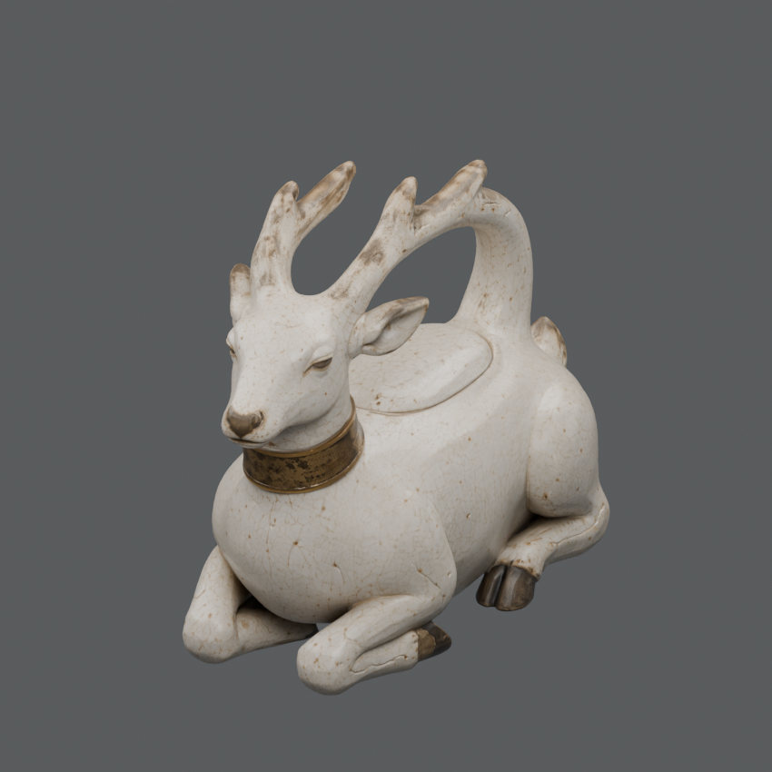
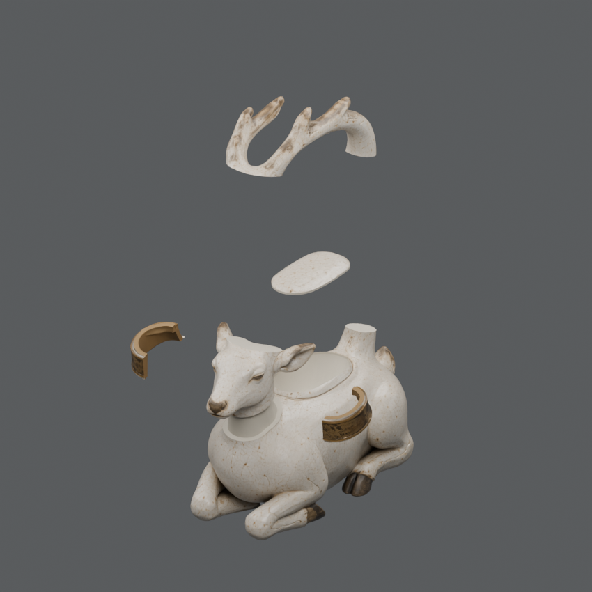
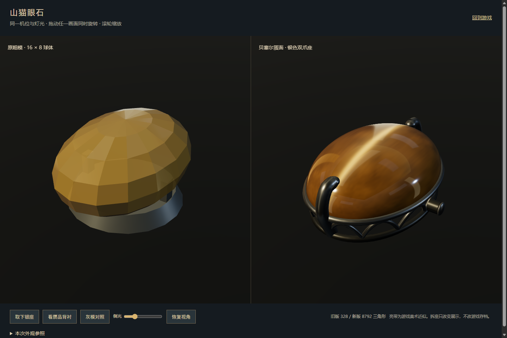
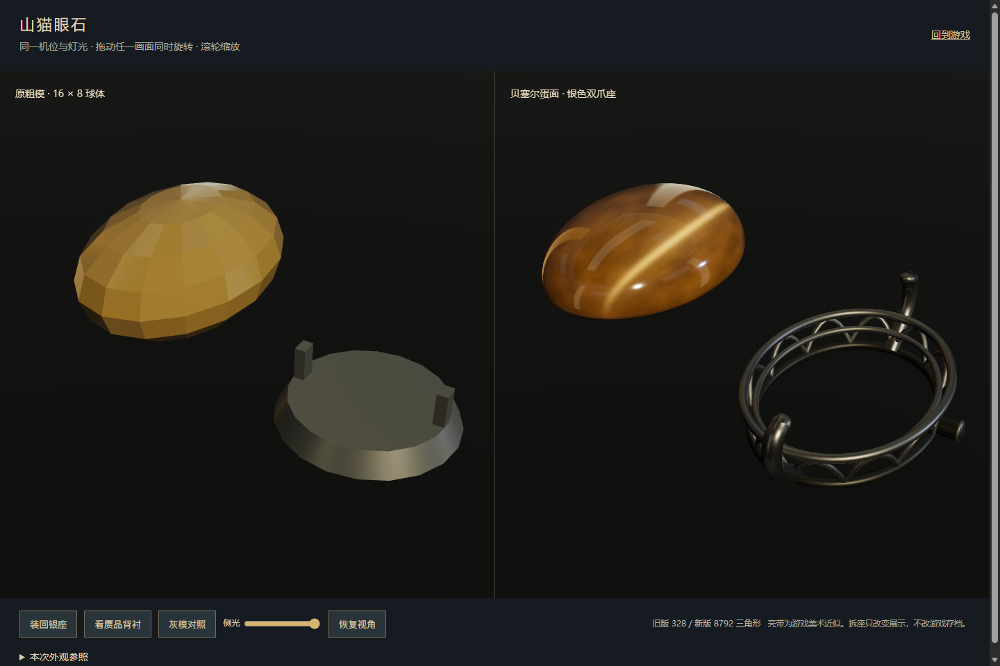
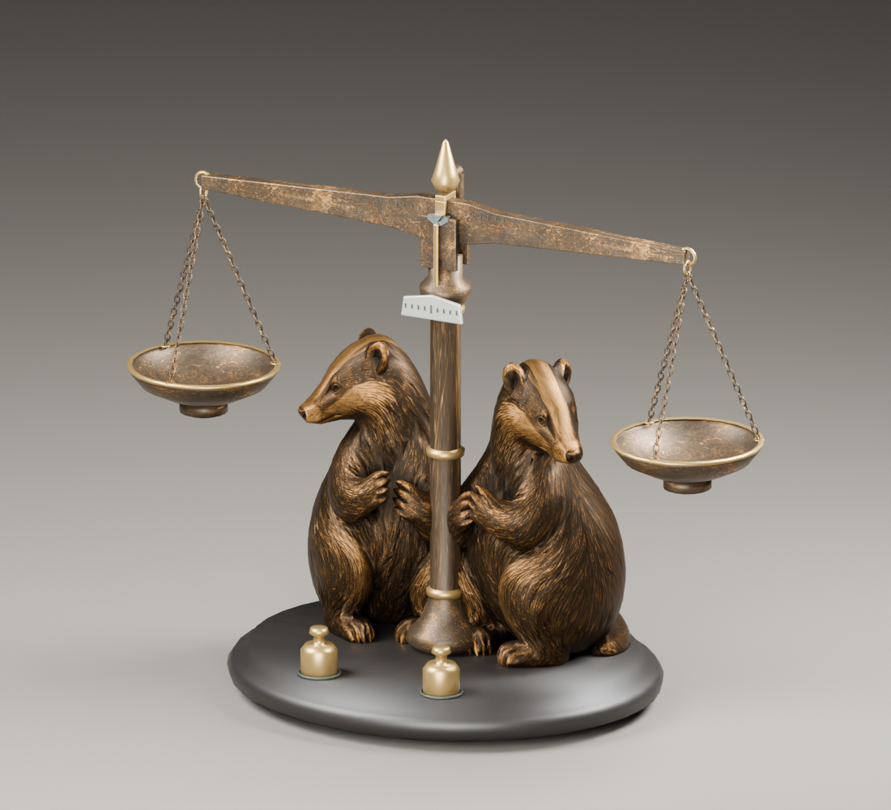
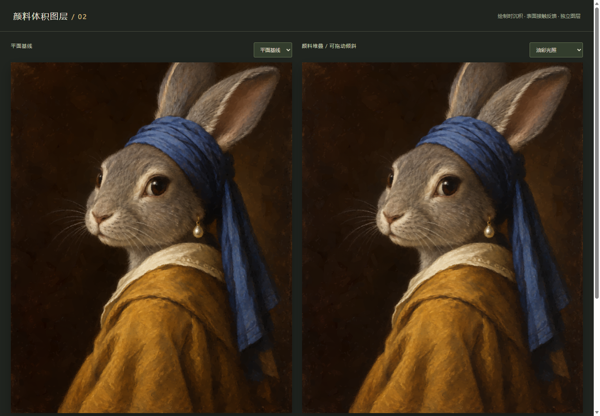
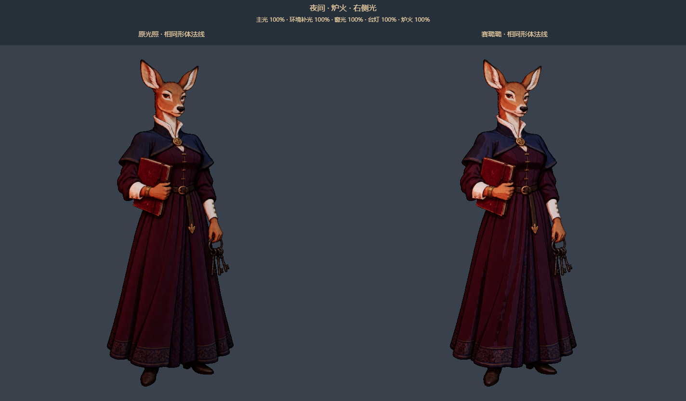
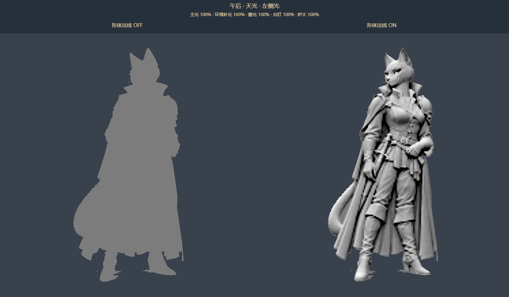

# Curio Asset Skills

**把参考图做成可检视、可拆装、可重新打光的游戏资产。**

从一款中世纪动物世界游戏的制作过程中整理出的 **9 个 AI 编程代理技能**：机关藏品、拆件补面、油画、画框、宝石玉牌、人物法线，以及 Meshy 和 Blender 资产流程。中文工作流为主，包含提示词、参数示例、Python 工具与验收方法。

Reusable agent skills for game props, oil paintings, jewelry, relightable 2.5D characters, Blender and Meshy. Instructions and tools are included; the showcased game assets are not an asset pack.

[技能目录](#技能目录) · [双獾药秤案例](examples/badger-balance/README.md) · [安装](#安装) · [使用示例](#使用示例) · [工具与验证](docs/usage.md) · [授权说明](#授权)

## 眠鹿圣油壶：从整件到可检查部件

| 整体 | 拆件 |
|:---:|:---:|
|  |  |

基于 Meshy 来源的六足鹿形陶壶，拆出壶身、盖、柄和两半颈圈，保留材质与接缝关系。这里展示的是五部件检查渲染；加工、紧固和完整拆装路径需要另外实现与验证。

对应技能：[机关藏品](skills/curio-mechanism-workshop/SKILL.md)、[拆件补面](skills/mesh-split-fill/SKILL.md)、[零件加工玩法](skills/curio-part-finishing/SKILL.md)。

## 山猫眼石：贝塞尔蛋面与可分离银座



左为原粗模，右为程序生成的蛋面、腰棱与双爪银座。亮带随光向和视角变化，作为游戏里的猫眼效果近似。



截图版本采用前拱、平底封盖；技能进一步整理了**独立前后贝塞尔截面、浅拱背、切面亭部、实体玉牌**的选择方法。它提供设计与建模工作流，不附带截图中的游戏构造器。

对应技能：[珠宝与玉牌](skills/curio-jewelry-workshop/SKILL.md)。

## 双獾药秤：降面、展 UV、烘焙与 LOD



这件药秤记录了完整制作链路：**单獾高模 1,342,390 → Remesh 5,212 个三角形 → 重新展 UV → 烘焙／后续贴图修正 → 装配两只獾与代码机构 → 陈列低模**。

整台秤的近看预算为 **28,120** 个三角形，陈列版为 **3,934**，均计入两只獾的实例。完整案例附真实 UV 布局对照、各阶段文件大小、共享贴图打包和历史实际费用；同时区分 R01 烘焙与 R02 最终材质。

查看：[双獾药秤制作案例](examples/badger-balance/README.md) · [模型／UV 流程](skills/curio-mechanism-workshop/references/meshy-pipeline.md)。

## 油画：画芯、笔触、织纹和表面层



真品／赝品的画面差异与干净／脏污状态分别记录。画芯和框体分开，浅浮雕、笔触、油膜与补痕按用途独立处理。静态材质生成和动态清洁玩法也各有明确边界。

对应技能：[油画](skills/curio-oil-paintings/SKILL.md)、[画框与纹章](skills/curio-frame-workshop/SKILL.md)。

## 人物：让 2.5D 插画响应游戏灯光





保持原画与轮廓，单独制作配准的形体法线，再检查左右光与赛璐璐分档。这是插画平面的重新打光；法线由插画估计，不等于三维模型烘焙或骨骼角色。

对应技能：[Noir 人物与法线](skills/noir-character-pipeline/SKILL.md)。以上均为项目原始渲染／工作台截图，来源与展示授权见 [图片说明](docs/images/README.md)。

## 技能目录

| 技能 | 用途 | 随附内容 |
|---|---|---|
| [curio-mechanism-workshop](skills/curio-mechanism-workshop/SKILL.md) | 机关藏品、降面、展 UV、LOD、图标 | 规格模板、材质／Meshy 路线、GLB 检查器、双獾药秤案例 |
| [mesh-split-fill](skills/mesh-split-fill/SKILL.md) | 网格拆件、接缝与互补补面 | Blender 入口、几何工具、真实过程页；第三方 MIT |
| [curio-oil-paintings](skills/curio-oil-paintings/SKILL.md) | 动物油画、配准真伪画芯、颜料与污渍 | 10 个配方、任务准备与表面生成脚本 |
| [curio-frame-workshop](skills/curio-frame-workshop/SKILL.md) | 可复用画框、尺寸适配、动物纹章 | Blender 生成器、4 种框型、5 种纹章 |
| [curio-jewelry-workshop](skills/curio-jewelry-workshop/SKILL.md) | 蛋面、切面宝石、玉牌与镶座 | 正背面设计规则、参数示例；无通用建模脚本 |
| [noir-character-pipeline](skills/noir-character-pipeline/SKILL.md) | 插画人物、遮罩、形体法线与材质 | 提示词、贴图检查器、运行时调光规则 |
| [curio-part-finishing](skills/curio-part-finishing/SKILL.md) | 连续去料、过切失败、买料与手动复装 | 玩法设计与颈圈示例；需接入目标游戏 |
| [evolve-blender-assets](skills/evolve-blender-assets/SKILL.md) | 可复现 Blender 资产与版本比较 | 契约、候选、来源与验证脚本；适合进阶管线 |
| [meshy-3d-generation](skills/meshy-3d-generation/SKILL.md) | Meshy 生成、贴图、骨骼与动画任务 | 官方技能快照、CLI 用法；第三方 MIT |

先选当前任务需要的技能。基础道具制作不必启用进阶资产契约；不使用 Meshy 就不需要其账号。每个技能的 `SKILL.md` 是入口，详细规则按需读取 `references/`。

## 安装

下载或克隆：

```sh
git clone https://github.com/wss534857356/curio-asset-skills.git
cd curio-asset-skills
```

用 Python 3.10+ 安装一个技能到目标项目：

```sh
python tools/install.py --target ../my-game/.agents/skills --skill curio-jewelry-workshop
```

或安装整套：

```sh
python tools/install.py --target ../my-game/.agents/skills --all
```

将 `../my-game` 换成自己的项目；macOS/Linux 可使用 `python3`。安装器仅复制技能及各自许可证，遇到同名目录会停止，不覆盖已有技能。全局安装可将目标改为 `~/.codex/skills`（设置 `CODEX_HOME` 时用其下的 `skills` 目录）。也可以直接复制选定技能的完整目录。

在支持 `SKILL.md` 的代理里开启新会话并调用技能。安装指令不安装 Blender、图像生成服务、Meshy CLI 或 API 凭证；工具条件见 [使用指南](docs/usage.md)。

## 使用示例

```text
使用 $curio-jewelry-workshop，给椭圆蛋面设计前高后浅的背部，保留腰棱，重新核对银座承托和拆装。

使用 $curio-oil-paintings，做一对配准的动物油画，只将珍珠改成钻石；油污独立成层。

使用 $noir-character-pipeline，给这张人物立绘补专用形体法线，保持原画和遮罩，并做左右光对照。

使用 $curio-mechanism-workshop，按参考设计可开盖的音乐匣，结构件代码制作，浅浮雕用法线，复杂圆雕再考虑 Meshy。
```

提供实际参考文件、目标引擎与本次需要的交付阶段。付费生成的范围和预算由具体任务授权；本仓库的安装与验证不会提交生成任务。

## 验证与维护

运行时案例：[提灯首次点火卡顿](skills/curio-mechanism-workshop/references/first-interaction-performance.md)，包含原因、诊断分支、稳定灯光配置的修复及首次／重复操作验证。

```sh
python -m pip install -r requirements.txt
python tools/validate.py
python -m unittest discover -s skills/mesh-split-fill/tests -v
```

验证覆盖技能元数据、引用文件、配置解析、Python 语法和图片可读性；脚本与安装的离线检查见 [使用指南](docs/usage.md)。这些检查不保证模型外观或游戏接入完成，付费服务与实际引擎验证按任务另行执行。

公开版移除了本机绝对路径与原游戏专用接入依赖。欢迎通过 Issue / PR 提交可复现的问题、工具版本和最小样例，避免附上密钥、签名下载链接或私人存档。

## 授权

- **自有技能文档、脚本、参数与程序纹章：MIT**，见 [LICENSE](LICENSE)。
- **第三方技能：保留原 MIT 与署名**。`mesh-split-fill` 归 WentianYi2025，`meshy-3d-generation` 归 Meshy；来源和快照信息见 [THIRD_PARTY_NOTICES.md](THIRD_PARTY_NOTICES.md)。
- **图库截图仅用于展示，不随代码授予 MIT 素材使用许可**，见 [ASSET_NOTICE.md](ASSET_NOTICE.md)。仓库不分发对应模型、角色原图或游戏素材包。
- Meshy、Blender、图像服务各自的产品、生成资产和商标权利由其相应条款约束。本集合是独立整理，不代表这些项目的官方背书。
