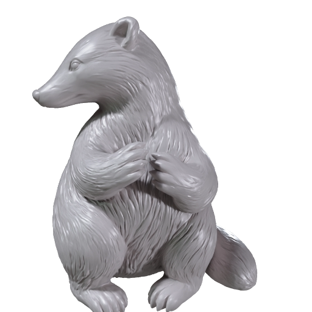
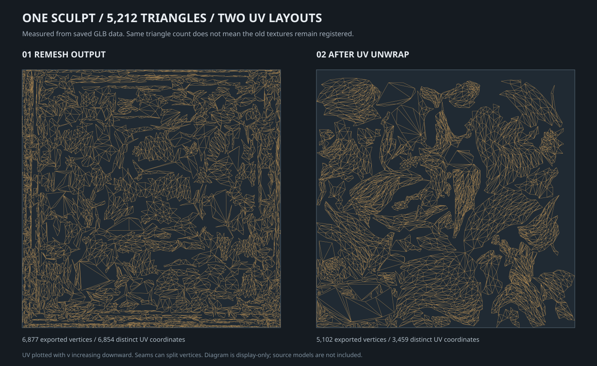
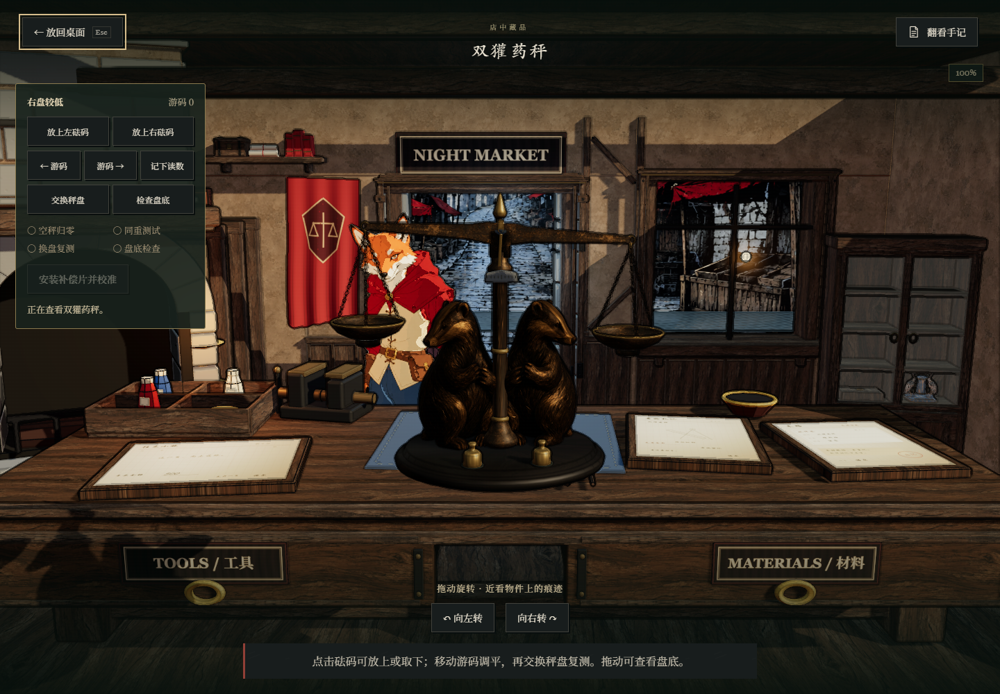

# 双獾药秤：高模降面、展 UV、烘焙与游戏 LOD

这个案例展示 A02 双獾药秤如何从单个獾雕高模进入可交互游戏资产：**复杂圆雕交给 Meshy，秤梁、转轴、吊盘和砝码用代码制作**，最后组装、共享材质并派生陈列低模。


这是现有制作记录的公开整理。2026-09-26 重新读取了本地 GLB、UV 数据和任务记录；未重新提交付费任务，也未重跑整套游戏验收。对应 [机关藏品技能](../../skills/curio-mechanism-workshop/SKILL.md) 与 [Meshy 制作步骤](../../skills/curio-mechanism-workshop/references/meshy-pipeline.md)。

## 1. 先分清哪些要生成，哪些要精确建模

| 部分 | 制作方式 | 原因 |
|---|---|---|
| 獾圆雕 | 一只 Meshy 雕像，另一侧镜像复用 | 需要真实轮廓、口鼻、爪和毛发体块 |
| 底座、中柱、刀口座、秤梁 | 参数化几何 | 控制尺寸、支承和真实旋转中心 |
| 链条、秤盘、游码、砝码与盘底盖 | 独立代码部件 | 保留操作、悬挂和拆看接口 |
| 磨痕、细纹和凹凸 | 贴图／法线 | 表面细节不全部留在运行几何中 |

没有将整台天平送入一次 Remesh：那样不能指望仍保有原来的活动节点、转轴和游戏操作绑定。

## 2. 单獾从 134 万三角形降到 5,212



上图是形体生成阶段保存的预览，不是低模线框。下面是本次从实际文件重新读取的计数；大小按十进制 MB/KB 表示。

| 单獾阶段 | 三角形 | 文件字节 | 文件内容 |
|---|---:|---:|---|
| 原始高模 | 1,342,390 | 32,218,356 | 形体源文件，约 32.22 MB，未进入游戏包 |
| Meshy Remesh 中模 | 5,212 | 252,380 | 中间几何，约 252 KB |
| UV Unwrap 输出 | 5,212 | 196,244 | 重新排布 UV 的无纹理模型，约 196 KB |
| R01 本地烘焙材质版 | 5,212 | 3,431,776 | 含 1K 法线等贴图的历史版本 |
| R02 PBR 整理版 | 5,212 | 5,453,716 | 后续贴图修正版，供最终装配使用 |

单獾三角形减少约 **99.61%**。几何变轻不代表最终带贴图的文件也只有 196 KB；贴图需要单独预算。Remesh 的目标预算也不等于输出保证，本例规格目标约 5,000，下载后实测 5,212。

## 3. 展 UV 之后，旧图不能直接套回去



这张图直接从 `badger-mid.glb` 与 `badger-uv.glb` 的 `TEXCOORD_0` 和三角形索引绘制，不是示意岛屿。两份模型都有 UV 属性，三角形数也相同，但布局已经改变；接缝会分裂顶点，所以导出顶点数不应当作三角形数。

- 左：Remesh 输出，6,877 个导出顶点、6,854 个不同 UV 坐标。
- 右：UV Unwrap 输出，5,102 个导出顶点、3,459 个不同 UV 坐标。
- UV 图用于看布局，本次没有据此宣称零重叠、零拉伸或烘焙完全合格。

本例先生成高模，再降面，之后执行一次 UV Unwrap。代码制作的框架、梁和盘使用规则 UV，不为它们额外调用付费 UV 服务。

## 4. R01 烘焙与 R02 贴图修正分开记录

**R01：把高模细节烘到新 UV。** Blender 中以高模为来源、UV 中模为 active target，用 Cycles 的 selected-to-active 烘焙切线法线，输出 1024×1024 法线图；另外制作 AO 与局部铜色材质。法线按 Non-Color 读取，不把旧 UV 的法线套回新布局。

历史脚本使用 cage extrusion 0.012、max ray distance 0.04、margin 8 像素。这是本例源坐标与 1K 图的参数记录，不能直接当作所有模型的单位尺度与通用安全值。

**R02：在现有 UV 模型上重新贴图。** R01 的通用铜色没有充分表达参考中的深底色、面部浅金纹路和磨痕，因此复用 UV 模型及独立獾雕参考执行 Retexture，没有重新生成几何。最终装配使用 R02 PBR 图，不能把 R01 的本地烘焙法线说成最终 R02 法线的来源。

Retexture 结果偏灰白，随后按已知铜雕材质修正金属度，并保留新贴图中的纹路。导出时也检查了 GLB 的颜色系数，避免 Blender 节点内看得见的校色在导出后丢失。

## 5. 装配两只獾，再做整台秤的陈列版

单獾重用同一 mesh 与材质，右侧通过镜像和装配变换得到。镜像减少重复生成和储存，并不会让实际绘制的第二只獾不计入预算。

| 整台药秤 R02 | 存储的网格三角形 | 含节点实例的预算 | GLB 本体字节，不含外置纹理 |
|---|---:|---:|---:|
| 近看中模 | 22,908 | **28,120** | 937,880 |
| 陈列低模 | 3,284 | **3,934** | 197,996 |

陈列版复用中模的尺寸、支撑面、语义节点和材质，按部件降低采样或简化；单獾降到约 650 个三角形，其他结构件也分别处理。两只獾仍计入整件预算。两档整件含实例计数相差约 **86.01%**，不等于同幅画面的实测 GPU 提速。

近看模型保留称量、移动游码、交换秤盘、检查盘底和校准所需节点。吊盘与梁端保持连接，游戏中反向补偿梁的旋转使盘垂直悬挂；这属于游戏机构近似，不是自由刚体仿真。

## 6. 打包还要处理共享贴图

实际 R02 运行资源：

| 项目 | 字节 |
|---|---:|
| 原式、修复、赝品、陈列共 4 个 GLB | 3,011,728 |
| 共用 5 张纹理 | 6,783,824 |
| 32 / 64 像素图标 | 5,676 |
| 合计 | **9,801,228，约 9.80 MB** |

约 69.2% 仍在贴图中，所以只做降面不能解决全部包体问题。四种模型通过外置共享纹理去重；高模、作者工程和下载缓存留在作者目录。当前 R02 合计不同于早期 R01 文档的约 6.5 MB，不混用版本数字。



这是原项目保存的 R02 游戏截图，用于展示当时接入效果，不代表本次重新执行了购买、校准和刷新存档测试。

## 7. 费用与证据

| 历史任务阶段 | 记录状态 | 记录的实际 Meshy 积分 |
|---|---|---:|
| 单獾形体生成 | SUCCEEDED | 20 |
| Remesh | SUCCEEDED | 5 |
| UV Unwrap | SUCCEEDED | 5 |
| R02 Retexture | SUCCEEDED | 10 |
| 合计 | | **40** |

这些数值来自保存的任务结果，是这个案例的历史消耗，不是当前报价；不包含图像生成服务的费用。公开版仅保留阶段、状态与消耗，未上传任务 ID、凭据或签名下载链接。

[metrics.json](metrics.json) 保存本次检查的 9 份模型统计、运行资源字节数和历史阶段摘要。模型的三角形与 UV 属性来自 GLB 元数据，UV 展示图进一步读取了实际坐标与索引；没有新增宣称网格无自交、纹理无失真或所有游戏功能通过。

给自己的模型做同类检查，可使用已收录的工具：

```sh
python skills/curio-mechanism-workshop/scripts/inspect_glb.py path/to/mid.glb --max-triangles 35000 --require-uv
python skills/curio-mechanism-workshop/scripts/inspect_glb.py path/to/display.glb --max-triangles 4000 --require-uv
```

以上路径需替换为自己的输入。这个公开案例不分发源 GLB、完整纹理或游戏运行代码；文档和统计采用 MIT，所有模型展示图及 UV 图适用 [展示图片说明](../../ASSET_NOTICE.md)。獾圆雕来源工具署名：**Meshy**。
