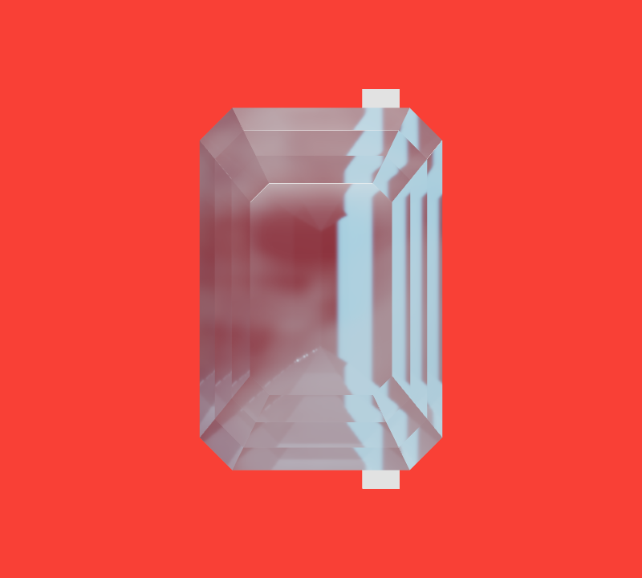
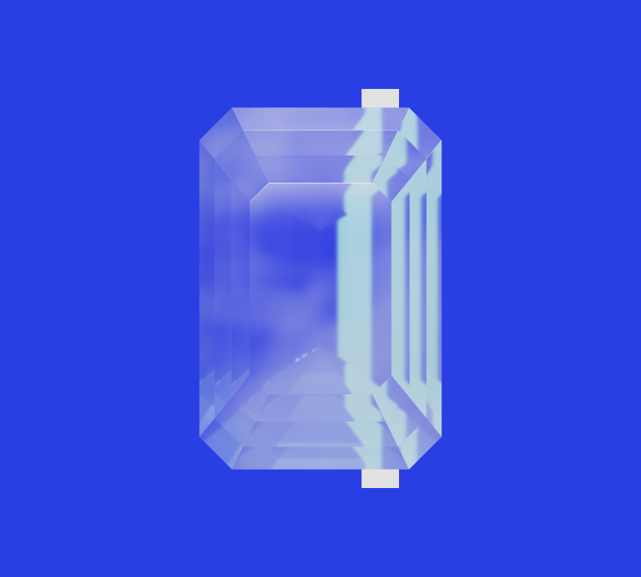

# 切面裸石：几何、透射与陈列

这组案例从游戏的十种裸石整理出可复用方法：圆钻、椭圆、梨形、马眼、心形、公主方、祖母绿式、阿斯切、枕形和玫瑰式。钻石切型与矿物物性分开处理；游戏中的彩晶参数不代表真实钻石光学。

## 光学面与三角形分开统计

2026-09-28 读取当前十件 GLB 的实际绘制数据与文件大小：

| 切型 | 实际三角形 | 文件字节 |
| --- | ---: | ---: |
| 梨形 | 108 | 13,228 |
| 圆钻 | 110 | 13,084 |
| 椭圆 | 110 | 13,168 |
| 马眼 | 110 | 13,132 |
| 心形 | 110 | 13,132 |
| 公主方 | 66 | 8,280 |
| 祖母绿式 | 128 | 14,416 |
| 阿斯切 | 140 | 15,496 |
| 枕形 | 158 | 17,788 |
| 玫瑰式 | 58 | 7,896 |

合计 **129,620 字节**。圆钻例子的 57 个非腰棱设计面，连同 16 个腰棱面，最后三角化为 110 个三角形；这些数字不是同一个口径。几何已很轻，后续成本主要还需查看材质、采样目标与环境采集。

[机器可读统计](metrics.json) 区分实际 GLB 三角形、文件大小和生成器记录的设计面数。本仓库不分发这些 GLB 或原游戏构造器。结构方法见 [切面设计](../../skills/curio-jewelry-workshop/references/faceted-cuts.md)。

## 背景变化才是通透的证据

原实现用不透明的背向金属壳增强内部反光，结果这层壳先进入了背景采样，外表面设为透射仍无法看到真实后景。修订后由真实前后切面承担透射，不用这层壳模拟亭部。

以下是项目此前保存的同一长阶模型正面控制实验：相机、反射和光照不变，仅切换后方平面的颜色。白条穿过宝石后能看到偏折。

| 红色后景 | 蓝色后景 |
| --- | --- |
|  |  |

这是屏幕空间体积透射的诊断图，不是完整多次光线追踪，也不是宝石真伪鉴定。图中网格没有为测试更换，截图没有补画。图片仅作展示，见 [授权边界](../../ASSET_NOTICE.md)。

## 进入游戏还要处理哪些问题

- 陈列使用已经受光的正反面烘焙图，避免再叠一次漫反射造成发白。
- 拿近时切换到当前相机的真实后景透射，房间反射缓存单独复用。
- 只给选中的一枚启用近景透射，限制独立的透射缓冲尺寸。
- 检查首用的全部材质变体；本案例的 Three 0.185.1 还需要准备背向透射通道。
- 统一几何厚度、场景缩放与吸收距离，避免拿起放大时突然换色。
- 返回、取消拿起和连续切换，都恢复材质、位置及共享资源的正确归属。

具体分支与验证方法见 [透射与陈列](../../skills/curio-jewelry-workshop/references/transmission-and-display.md)。本次补充复查了源码和资产清单；控制实验图来自已有项目记录，没有把历史性能数据包装成本次新的运行测量。
