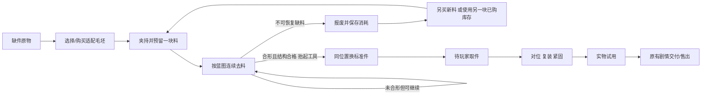

# 蓝图、连续去料与复装状态

这是游戏交互契约与建议实现路线，不是已经实现的雕刻引擎。具体实现应优先复用所在游戏的拾取、夹具、材料库存和存档。

## 三份几何，各司其职

1. **毛坯体W**：当前剩余材料，可被工具削减，厚度和背面真实存在。
2. **目标体T与蓝图**：从标准件简化的大轮廓/截面；刻线、目标区与判定共用这一份数据。
3. **标准件C**：已制作好的最终节点，带完整UV、纹样、安装枢轴与接触面。仅在加工合格后替换W，不参与自动削坯。

另定义结构必留区K与误差带：K是接头肩部、最小壁厚、连续桥等，不能仅用整体面积平均。误差带允许形状略不精确，并非禁止越线的碰撞层。

不要从目标图的亮度直接推几何；不要仅擦除平面贴图后让未变化的立方体通过。

## 选最简单但足够的去料表示

| 零件类型 | 建议表示 | 实际检查 |
| --- | --- | --- |
| 平扣舌、木楔、榫头 | 多面高度场/有厚度的轮廓网格 | 至少主面与侧面；肩、根、厚度由同一余量场计算 |
| 销轴、圆柱衬套 | 轴向×角度的半径场 | 旋转夹具检查背面、圆度与台阶；不以六段点击次数代替半径 |
| 颈圈半片、曲面罩 | 局部曲面高度场；有切穿需求时用小范围体素/SDF或受控切削网格 | 内弧、外沿、端面、厚度和连通性；前后轮廓同时约束 |

无需默认全物体布尔雕刻或刚体仿真。可以用低密度加工网格，但要让真实工具轨迹改变位置/深度，再从其派生可见几何与碰撞。三维加工面必须可达，工具不能隔壳磨背面。

## 输入与连续扫掠

毛坯由台钳、软夹或托块承托。按住工具手柄/加工按钮并拖动才使用手锉；另一手势旋夹具或相机。当前有效接触面必须突出显示。

对相邻采样做扫掠，不只在鼠标事件末点挖洞。手锉去料量按接触行程长度、刀具宽度、材料配置和粗/细档积分：

```text
removed = cutting_rate(material, tool) * swept_contact_length * contact_weight
```

相同轨迹在30/60/120Hz采样下应得到近似相同结果。手锉按住不动、抬手或仅点击不能积累去料；如果另做磨轮，才按真实转动与接触时间计料，不混用手锉规则。掉帧后的长段要细分，不能跳过红区。体素/高度值只能减到实际零，不能在目标T处强行截停。

失焦、切件、指针取消、打开材料面板会停止本次工具接触，并保存已发生的去料。不能让弹窗遮住后后台继续磨坏。

## 轻吸附：给方向感，不替玩家完成

初始调参建议：捕获半径6 CSS像素，脱离半径10像素，最大混合系数0.18。它们是可调手感值；模型/视图缩放后重新将屏幕距离映射到当前工件局部坐标。

`p`为用户原始接触点，`q`为当前选定蓝图轮廓附近的合法工具中心位置（考虑刀头半径）。在捕获带内：

```text
a = 0.18 * smooth_falloff(distance(p, q) / capture_radius)
assisted = p + a * (q - p)
```

始终从原始输入p计算，不能不断把上帧吸附后位置当新原点越吸越牢。短暂锁定邻近同一条轮廓，避免在内外环之间跳吸；方向明显离线时及时释放。吸附移动量只占小部分输入，不主动沿轮廓切线推进。

蓝图线、允许带与红色过磨预警保持可见。刻意斜拖或停留在错误位置仍能越过目标、切断关键处。不得把自动避开关键区、到线停料或自动修完整圈叫做“轻吸附”。

## 约略合形与报废

建议初始量化方法：

```text
shape_percent = 100 * volume(W ∩ T) / volume(W ∪ T)
missing_ratio = volume(T - W) / volume(T)
```

规则可按物件调整，首版示例为：形似度≥85%，目标缺料≤5%，关键接触面全部达到宽松模板范围，结构连续且最薄处≥设计基准的60%。这些是玩法值，不是制造公差。

余量未去够时可以继续加工；轻微越线但仍在容许误差内也可合格。目标缺料达到3.5%或最薄处低于基准75%时先预警；缺料>5%、承力桥断开、孔/榫肩超过不可恢复界限或最薄处低于60%才报废。不可逆缺料的合格上限与报废边界必须衔接，不能出现“缺料太多不准合格、又没到报废、且永远补不回来”的死区。网格精度造成的边缘锯齿可容差，但不能形成不会失败的保护墙。

表面细节只占轻权重，精密花纹可由C补足；不能用表面磨亮遮蔽厚度错误。百分比优先显示形状接近程度，结构危险单独反馈，不把两者平均成一个总分。

## 材料与状态



- 每块毛坯有独立`attemptId`和`materialLotId`。预留一块，首次实际去料耗用一次；未用毛坯可撤夹退回同一库存实例，不能重复退料。
- 报废改变当前毛坯状态，不能只减钱后原地恢复。报废记录先保存，再显示“需要另一块料”；无免费第一块重试。
- 购买通过现有材料商，显示材料规格和价格，点击购买才扣钱；余额不足进入待购，已磨好的其他零件不丢失。库存中另一块先前买好的适配料可以使用，不要求为了重试再买第三块。
- 订单工钱照旧在交件时给，不能用“重试”重新领单或重领预付款。材料价格是独立配置，禁止藏在手势回调里扣钱。
- 持久化加工场快照、工具/夹具姿态、材料批次、报废与标准件状态；不存每帧轨迹/PNG或大套NPZ。预留/扣料/报废/换模等关键操作应幂等。

## 换标准件的边界

在合格判定后、玩家释放工具时进入短收尾。擦去碎屑或用量样遮挡一瞬，原位替换为C；相机和原物不移动，标准件保持加工件的比例、位置和朝向。若差异明显，先检查蓝图与C是否配准，不用浓烟掩盖形体突变。

标准件上可以保留“本次新配”的材质差异或玩家本次质量记录；工厂刻纹可以由预制UV/法线补齐。复用旧模型造型不代表新件凭空拥有旧物年限或证据。

换模仅进入`finished-part-ready`，不能顺便设置`assembled/tested/paid`。报废状态永不调用换模函数。

## 手动复装

拿到标准件后，玩家拖到真实安装部位，旋到相容方向，近距离才给安装吸附。安装吸附和打磨轻吸附是两套参数；不能从托盘远处瞬移入槽。

错向、错侧、错槽不吸入。先试放、再锁销/收扣/合盖，最后做该件的受力或开合测试。模型/接口本身穿插时修作者资产，不向已磨合格的玩家再收费。原物的其他缺损仍保留，局部打磨不得“连带修好”无关机关。

## 有意义的验证

1. 毛坯同一点连点、静止按住均不推进手锉；沿正确轨迹实切可改变侧面与剪影。
2. 同一条采样稀疏/密集的笔划去料近似一致，跨目标的快拖不会漏检。
3. 边线轻吸附可被拖开；故意切过K产生报废；错件不会因高形似度通过。
4. 失败后刷新仍是废料且库存已耗；另购一块只扣一次；另一半已完成零件保留。
5. 合格抬手后C在同一工位出现，但原物仍缺件；必须玩家复装、紧固、试用才可交付。
6. 合格与报废各保留一段实际3D证据，检查夹具支撑、相机边界、100%/200%显示与工具遮挡。
